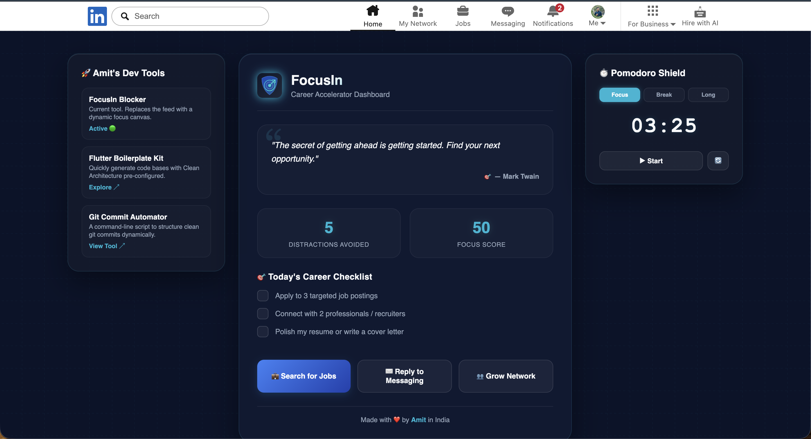
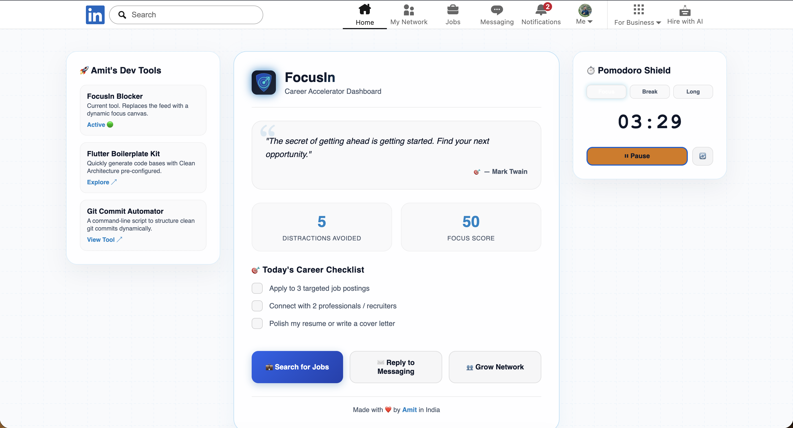
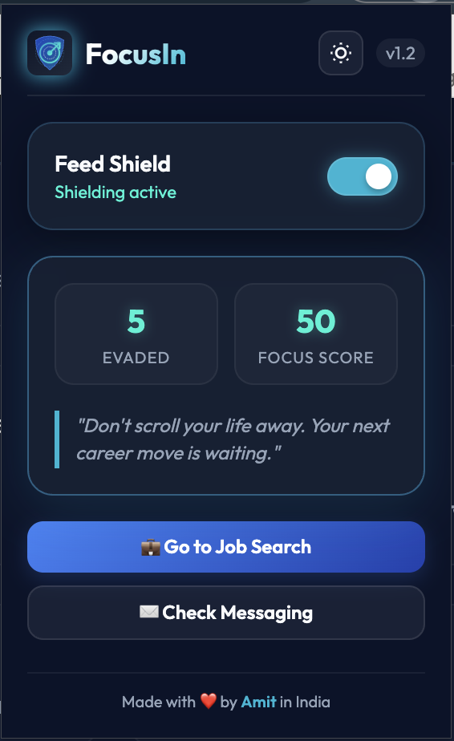

# FocusIn: LinkedIn Career Accelerator 🚀

Simply hides the distracting LinkedIn home feed and replaces it with a premium focus dashboard to help you find jobs and build connections instead of falling into a mindless scrolling habit.

---

## 🎨 Visual Showcase

| Dark Mode | Light Mode | Setting Menu |
| :---: | :---: | :---: |
|  |  |  |

---

## 📽️ Interactive Demos

<table>
  <tr>
    <td align="center" width="50%"><b>⚙️ How to Install Guide</b></td>
    <td align="center" width="50%"><b>🎥 FocusIn Features Walkthrough</b></td>
  </tr>
  <tr>
    <td>
      <!-- <video src="images/output.mov" width="100%" autoplay loop muted playsinline></video> -->
      <video src="https://github.com/user-attachments/assets/aaca3c9e-a65d-4572-b5a3-93ffb58ff8a7" width="100%" autoplay loop muted playsinline></video>
    </td>
    <td>
      <video src="https://github.com/user-attachments/assets/8ed601f9-d5e1-4948-9096-3e1a2829323a" width="100%" autoplay loop muted playsinline></video>
      <!-- <video src="images/How-to-install.mov" width="100%" autoplay loop muted playsinline></video> -->
    </td>
  </tr>
</table>

---

## ⚙️ Quick Installation (Chrome Developer Mode)

Load the extension locally in 5 simple steps:

1. **Download** or clone this repository to a folder on your computer.
2. **Open Settings**: Open Google Chrome and navigate to `chrome://extensions/`.
3. **Developer Mode**: Turn **ON** the **Developer mode** toggle switch in the top-right corner.
4. **Load Unpacked**: Click the **Load unpacked** button in the top-left corner.
5. **Select Folder**: Select this project folder (`linkedin-focus-extension`).

*Open `https://www.linkedin.com/feed/` to start accelerating your career!*

---

  <h3>Crafted with ❤️ in India 🇮🇳</h3>
  

